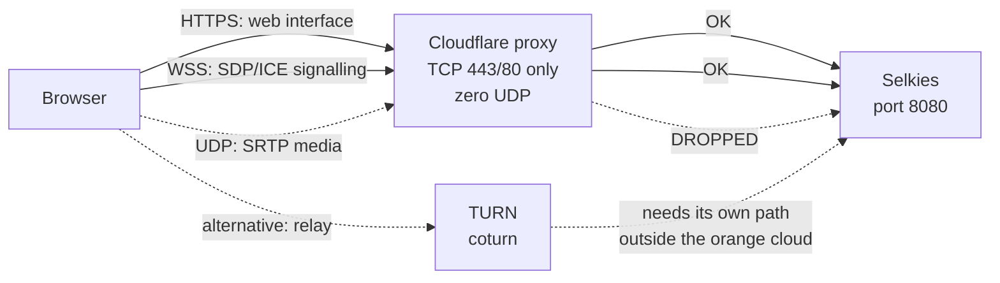
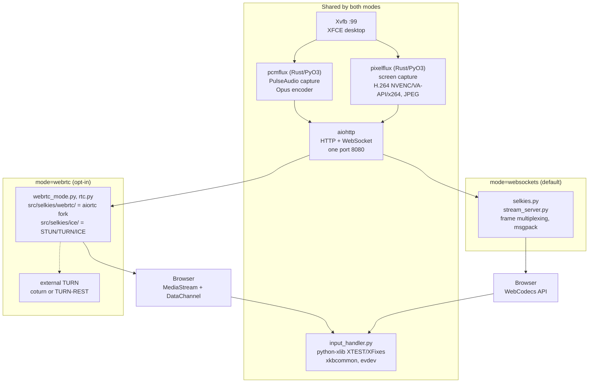
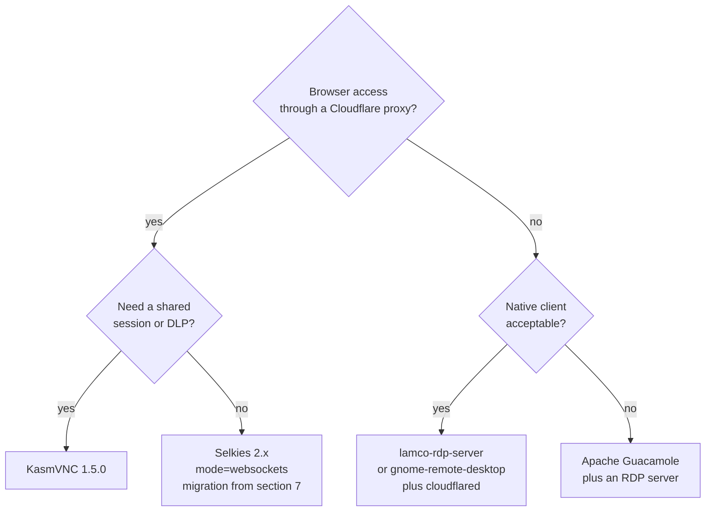

> **STATUS (2026-09-07): DONE.** The migration has been implemented — the image
> now streams over WebSocket (Selkies 2.x @ `be53b2c`) and WebRTC is gone.
> The diagnosis in this document is correct and was independently re-verified,
> but **section 7.4 is superseded** (see the note inside it): installing via
> `pip`/`npm` **inside the guest** violates the build rules, and `xkbcommon` is
> NOT a Python dependency at the pinned commit. Actual implementation and the
> traps found while doing it: [[1788739200-selkies-2x-websocket-migration]].

This document collects the whole investigation: KasmVNC vs Selkies, why the
stream fails behind a Cloudflare proxy, the Selkies 2.x architecture, an audit
of the current qcow2 builder, and the verified repair path.

**Date of findings:** 2026-09-07. Every claim marked as verified comes from
actually running the code or reading the sources, not from documentation.
Section [12](#12-verification-method) lists the steps performed.

---

## 1. Summary

| Question | Answer |
|---|---|
| Which mode does the image from `debian_qcow2-cloud-init-selkies.sh` use? | **WebRTC, with no way to change it** |
| Why does it fail behind a Cloudflare proxy? | The proxy carries no UDP and the image has no TURN — signalling gets through, media does not |
| Can it be switched to WebSocket? | Not in the old build. Selkies 1.6.2 has no `--mode` flag |
| Where is WebSocket mode? | Only on the 2.x branch, which has no released tag |
| Is the migration feasible? | Yes, verified. Install from a commit tarball; `pixelflux`/`pcmflux` wheels are prebuilt |
| Do the arguments need rewriting? | No. The entire current flag list parses unchanged |

---

## 2. Starting point: KasmVNC or Selkies

A distinction first: **KasmVNC** is an open display server (a TigerVNC fork),
while **Kasm Workspaces** is the commercial container-orchestration platform
that uses it. The comparison below is about KasmVNC.

| Dimension | KasmVNC 1.5.0 | Selkies 2.x |
|---|---|---|
| Core | C++, TigerVNC fork, built-in web and WebSocket server | A single Python application, `aiohttp` |
| Protocol | Proprietary, broken away from RFB — image-based (WebP/JPEG/QOI), plus a video mode since 1.5.0 | WebSocket by default, WebRTC optional |
| Codecs | H.264, H.265, AV1 in hardware via VAAPI and NVENC (new in 1.5.0) | H.264 and Motion JPEG; H.265 and AV1 planned, not implemented |
| Audio | Absent from the KasmVNC stack itself | Opus via `pcmflux` |
| Shared session | Many simultaneous users, permissions driven via API | No equivalent |
| DLP | Watermark, screen regions, key and clipboard logging, clipboard limits | None |
| License | TigerVNC fork (GPL) | MPL-2.0 |

**Ecosystem state.** LinuxServer.io sunset its KasmVNC stack and moved to
Selkies. The repositories show it plainly:

| Repository | Last release |
|---|---|
| `linuxserver/docker-baseimage-kasmvnc` | 2025-07-12 (`alpine321-89d8a445-ls32`) |
| `linuxserver/docker-baseimage-selkies` | 2026-09-06 |

Over a year without a release versus active development. The direction is
unambiguous, but KasmVNC remains the only choice when a session shared by
multiple operators or DLP features are required.

---

## 3. The network layer — why a Cloudflare proxy kills WebRTC

This is not a Selkies defect; it follows from what the orange cloud is.

Cloudflare in proxy mode terminates **only HTTP and HTTPS on a closed list of
ports**. UDP traffic is not carried at all. Support for arbitrary TCP and UDP
ports is a separate product (Spectrum), available on the Enterprise plan.

WebSockets, by contrast, are proxied with no extra configuration on all plans —
they are an ordinary HTTP connection with an upgrade, so they fit the proxy
model.

The consequence for WebRTC:



The symptom is characteristic and misleadingly looks like an application
failure: **the page loads, login works, and the desktop never appears.**
Signalling travels over HTTPS, so client and server exchange SDP and ICE
candidates, after which negotiation ends without an established media channel.

The only ways to push WebRTC through such a network:

1. **TURN over TCP/TLS on a separate path.** The TURN server must be reachable
   directly from the browser — a gray-cloud subdomain or a separate address.
   Cloudflare will not forward it.
2. **Cloudflare Tunnel.** It carries TCP through the tunnel, but requires a
   `cloudflared` client on the user's side, so it stops being "from the
   browser" access.
3. **Dropping WebRTC.** A transport that is one TCP connection on one port
   passes through the proxy like any other HTTPS.

Point three is the substance of the rest of this document.

---

## 4. The naming trap: 1.6.2 and 2.x are two different products

The `selkies-project/selkies` repository today contains two completely
different runtimes under one name, which is the main source of confusion.

| | Selkies 1.6.2 | Selkies 2.x (`main` branch) |
|---|---|---|
| Media engine | GStreamer, `webrtcbin` | `pixelflux` + `pcmflux` (Rust/PyO3 extensions) |
| Distribution | "Portable" tarball with a bundled conda GStreamer | Python wheel |
| Transport | **WebRTC only** | WebSocket by default, WebRTC optional |
| `--mode` flag | **Does not exist** | Exists, defaults to `websockets` |
| Release status | Released, tag `v1.6.2` | **No tag** — only `main` and CI artifacts |

**Verified:** `https://github.com/selkies-project/selkies/releases/latest`
redirects to `v1.6.2`. The atom feed and the tags page contain nothing newer —
no 2.0.0 prerelease.

**Verified:** unpacking `selkies_gstreamer-1.6.2-py3-none-any.whl` and dumping
the `add_argument` calls from `__main__.py` yields the full list of 48 flags:

```
json_config, addr, port, web_root, enable_https, https_cert, https_key,
enable_basic_auth, basic_auth_user, basic_auth_password, rtc_config_json,
turn_rest_uri, turn_rest_username, turn_rest_username_auth_header,
turn_rest_protocol_header, turn_rest_tls_header, turn_host, turn_port,
turn_protocol, turn_tls, turn_shared_secret, turn_username, turn_password,
stun_host, stun_port, app_wait_ready, app_ready_file, uinput_mouse_socket,
js_socket_path, encoder, gpu_id, framerate, video_bitrate, keyframe_distance,
congestion_control, video_packetloss_percent, audio_bitrate, audio_channels,
audio_packetloss_percent, enable_clipboard, enable_resize, enable_cursors,
debug_cursors, cursor_size, enable_webrtc_statistics, webrtc_statistics_dir,
enable_metrics_http, metrics_http_port, debug
```

`mode` is not on that list. Adding `--mode=websockets` to a 1.6.2 invocation
ends with an `unrecognized arguments` error.

Practical conclusion: **any builder that pulls `releases/latest` gets
WebRTC-only 1.6.2 today**, regardless of what the current documentation on
`main` says.

---

## 5. Selkies 2.x architecture — where WebRTC is, where WebSocket is

Selkies 2.x is a single Python process with one `aiohttp` server on one port
(8080 by default). **Screen capture, encoding, audio and input injection are
identical in both modes.** Only the layer that transports frames to the browser
differs.



### 5.1 Dependencies by mode

Derived from analysing imports in the source tree, not from the documentation.

| Package | Role | websockets | webrtc |
|---|---|:--:|:--:|
| `pixelflux` | X11/Wayland capture plus H.264 (NVENC, VA-API, x264) and JPEG encoder. Rust PyO3 extension | yes | yes |
| `pcmflux` | PulseAudio capture plus Opus encoder. Rust PyO3 extension | yes | yes |
| `aiohttp` | HTTP server, serves the web client, holds the WebSockets | yes | yes |
| `msgpack` | Binary serialization of control frames and input events | yes | yes |
| `python-xlib` (vendored) | Keyboard and mouse injection via XTEST, cursors via XFixes | yes | yes |
| `xkbcommon` | Keysym mapping. **See the correction in 8.1** — at `be53b2c` the C library is loaded via `ctypes`, not the Python package | yes | yes |
| `evdev` | Gamepads as kernel devices via `/dev/uinput` | yes | yes |
| `Pillow`, `aiofiles` | File transfer, binary clipboard | yes | yes |
| `psutil`, `prometheus_client`, `watchdog` | Statistics, metrics, config reload | yes | yes |
| `pynvml`, `aitop` | GPU load readout for the side panel | yes | yes |
| `pulsectl-asyncio` | Virtual microphone, PulseAudio sink management | yes | yes |
| `av` (PyAV/ffmpeg) | Audio and video frames for the aiortc fork — `webrtc/rtp.py`, `codecs/g711.py` | no | yes |
| `cryptography`, `pyopenssl` | DTLS handshake | no | yes |
| `pylibsrtp` | SRTP encryption of the media stream | no | yes |
| `google-crc32c` | SCTP checksums for DataChannel | no | yes |
| `pyee` | Event emitter used by aiortc | no | yes |
| `ifaddr`, `dnspython` | Interface enumeration and DNS while gathering ICE candidates | no | yes |

A "no" in the websockets column means that library's code never executes in
the default mode. **It does not mean the package can be uninstalled** — see 8.4.

### 5.2 Source module map

| Path | Mode | Responsibility |
|---|---|---|
| `src/selkies/__main__.py` | both | Branches on `--mode`, initializes uvloop |
| `src/selkies/settings.py` | both | ~70 setting definitions; generates the CLI and `SELKIES_*` variables |
| `src/selkies/media_pipeline.py` | both | Abstraction over `pixelflux` and `pcmflux` |
| `src/selkies/input_handler.py` | both | Keyboard, mouse, gamepads, clipboard, file transfer |
| `src/selkies/display_utils.py` | both | Resolution changes, DPI, cursor size |
| `src/selkies/selkies.py` | **websockets** | WebSocket loop, frame multiplexing |
| `src/selkies/stream_server.py` | **websockets** | HTTP server, basic auth, TLS, `--web_root` handling |
| `src/selkies/webrtc_mode.py`, `rtc.py` | **webrtc** | Peer connection session management |
| `src/selkies/webrtc/` (25 files) | **webrtc** | Vendored aiortc fork: DTLS, SRTP, SCTP, SDP, jitter buffer, pacer |
| `src/selkies/ice/` | **webrtc** | `stun.py`, `turn.py`, `candidate.py`, `mdns.py` — the NAT traversal layer |

The `ice/` directory exists purely to work around NAT. In WebSocket mode it is
not imported, because there is nothing to work around — there is one TCP
connection to port 8080, indistinguishable from ordinary HTTPS. That is the
single reason one mode crosses a Cloudflare proxy and the other does not.

---

## 6. Audit of the old image

Analysis of `linux-debian/debian_qcow2-cloud-init-selkies.sh` at commit
`7366622` (2026-09-04), i.e. the state **before** this migration.

### 6.1 Build model

Everything is done by `virt-customize` (libguestfs) on the
`debian-{12,13}-genericcloud-amd64.qcow2` image. Selkies was not installed on
first boot but baked into the image at build time:

```sh
SELKIES_VERSION="$(curl -fsSL 'https://api.github.com/repos/selkies-project/selkies/releases/latest' \
  | jq -r '.tag_name' | sed 's/[^0-9.\-]*//g')"
curl -fsSL "https://github.com/selkies-project/selkies/releases/download/v${SELKIES_VERSION}/selkies-gstreamer-portable-v${SELKIES_VERSION}_amd64.tar.gz" | tar -xzf -
echo "${SELKIES_VERSION}" > /opt/selkies_version
```

The download was deliberately placed **before** the DNS configuration block,
because removing `systemd-resolved` and swapping `/etc/resolv.conf` for
resolvconf breaks name resolution inside the appliance.

Payloads (`.service`, `start-*.sh`) are fetched from the repository and rendered
on the host with `envsubst` using a restricted variable list, so runtime
variables (`${HOME}`, `${DISPLAY}`, `${XDG_RUNTIME_DIR}`) stay literal in the
files.

### 6.2 Runtime architecture

Three decoupled systemd units:

| Unit | Role |
|---|---|
| `xfce-session.service` | Owns the display: Xvfb `:99` plus the XFCE session (X11, not Wayland) |
| `selkies.service` | Only attaches to the existing `:99` |
| `x11vnc.service` | Same `:99`, `-localhost`, its own `-rfbauth` password, access via SSH tunnel |

The separation means neither Selkies nor VNC owns the display — restarting or
stopping either client does not end the desktop session. **This architecture
was kept unchanged by the migration.**

### 6.3 The GStreamer conflict workaround (now removed)

The portable build's wrapper put Debian's `/usr/lib/.../gstreamer-1.0` into
`GST_PLUGIN_SYSTEM_PATH`. Those plugins are ABI-incompatible with the conda
GStreamer in the package (`undefined symbol: g_sort_array`,
`gst_structure_set_static_str`), and the wrapper also wiped
`~/.cache/gstreamer-1.0` on every start, so the scan repeated endlessly. Hence
this block in `start-selkies.sh.tpl`:

```sh
export GST_PLUGIN_PATH_1_0="${HOME}/selkies-gstreamer/lib/gstreamer-1.0"
export GST_PLUGIN_SYSTEM_PATH_1_0=""
export GST_REGISTRY_1_0="/var/tmp/selkies-gst-registry.bin"
```

This entire block is **gone** after the migration to 2.x, because there is no
GStreamer there.

### 6.4 Stream parameters (before the migration)

| Parameter | Value | Note |
|---|---|---|
| Encoder | `x264enc` | Software, no hardware acceleration |
| Frame rate | 30 fps | |
| Video bitrate | 8000 kbps | |
| Audio bitrate | 64000 bps | |
| `congestion_control` | `true` | The only encoder setting the client cannot override. `x264enc` ran `pass=cbr`, so without GCC it spends the full bitrate even on a completely static screen |
| `enable_resize` | `true` | |
| `ximagesrc use-damage` | `0` | Full per-frame cost regardless of screen changes |

`SELKIES_MAX_RES` is a **RANDR ceiling** set as the `-screen` geometry in Xvfb,
not the working resolution. `enable_resize=true` scales down via `xrandr`; above
the ceiling the image is scaled. (Xvfb 21.1.16 accepts
`xrandr --newmode/--addmode/--output --mode` up to that ceiling — an earlier
comment in the repository claiming otherwise was verified false.)

### 6.5 Which mode the built image would have

**WebRTC, with no way to change it.**

Two steps of reasoning:

1. Neither `--mode` nor `SELKIES_MODE` appeared anywhere in the repository —
   not in the builder, not in any `.tpl` template. The builder exported only
   `SELKIES_USER`, `SELKIES_PASSWORD`, `SELKIES_MAX_RES`, `SELKIES_RES`,
   `SELKIES_FRAMERATE`, `SELKIES_VIDEO_BITRATE`, `SELKIES_AUDIO_BITRATE` and
   `SELKIES_TURN_*`.
2. Even adding that flag would have changed nothing, because `releases/latest`
   returns v1.6.2, and that version has no `mode` parameter (section 4).

### 6.6 What the image did on a client's first connection

`SELKIES_TURN_HOST` defaulted to empty — deliberately, because the upstream
default `staticauth.openrelay.metered.ca` is dead (UDP 443 and UDP 80 both time
out, zero relay candidates). An empty value routes the code to the fallback
branch at line 598 of the 1.6.2 wheel:

```python
stun_servers, turn_servers, rtc_config = parse_rtc_config(DEFAULT_RTC_CONFIG)
logger.warning("missing TURN server information, using DEFAULT_RTC_CONFIG")
```

Where `DEFAULT_RTC_CONFIG` is:

```json
{
  "lifetimeDuration": "86400s",
  "iceServers": [ { "urls": ["stun:stun.l.google.com:19302"] } ],
  "blockStatus": "NOT_BLOCKED",
  "iceTransportPolicy": "all"
}
```

So the image started with **Google STUN only and no TURN at all**. Behaviour in
practice:

| Network scenario | Result |
|---|---|
| LAN, `host` candidate directly reachable | Works |
| Behind NAT, UDP allowed through | Works via the `srflx` candidate |
| Behind a Cloudflare proxy | **Never works.** The interface and signalling get through, the desktop loads forever |

---

## 7. Migration to Selkies 2.x — the verified path

### 7.1 Why this is feasible despite there being no release

The initial worry that installing 2.x requires compiling the Rust extensions
inside the appliance **turned out to be unfounded**. Both extensions have
prebuilt wheels on PyPI:

| Package | Version on PyPI | Wheels |
|---|---|---|
| `pixelflux` | 2.0.0 | `manylinux_2_28` and `musllinux_1_2`, cp39–cp314, x86_64 and aarch64 |
| `pcmflux` | 2.0.0 | as above |
| `selkies` | **1.6.1** | The old line, useless |

Bookworm (glibc 2.36) and trixie (glibc 2.41) satisfy the `manylinux_2_28`
requirement. The `selkies` package itself builds via `setuptools`, with no
compilation.

This is exactly what LinuxServer.io does in
`docker-baseimage-selkies/Dockerfile` — it downloads a specific commit's
tarball and installs it with pip, because `releases/latest` still points at
1.6.2.

### 7.2 Choosing the commit — not HEAD

This is critical. HEAD of `main` requires `pixelflux~=2.1.0` and
`pcmflux~=2.1.0`, while only 2.0.0 exists on PyPI. Installing from HEAD
**will not work**.

The pin landed in commit `7c40254` on 2026-08-24 ("fix: Various refactors").

| Commit | Date | Status |
|---|---|---|
| `be53b2c39670ccd1432fe50ebcd6d0ade72ce80a` | 2026-08-22 | **Recommended.** The last one with unpinned `pixelflux`/`pcmflux` |
| `348bc4f61da66198573e7e57db9a266aca1991d5` | older | The pin used by LinuxServer.io |
| `HEAD` of `main` | current | Does not install |

Both of the first two were installed in separate venvs — they work.

### 7.3 Argument compatibility

The most important finding for this migration: **the current flag list passes
unchanged.**

`selkies` was run at `be53b2c` with exactly the argument set that was in
`start-selkies.sh.tpl`. Zero `unrecognized arguments` errors:

```
INFO:selkies.__main__:Initiating server with websockets mode
INFO:main:Initializing DataStreamingServer with encoder: h264enc, Framerate: 30
```

Three reasons this works:

1. `_add_arguments()` in `settings.py` registers **both** spellings of every
   flag:

```python
cli_flags = [f"--{name.replace('_', '-')}"]
if "_" in name:
    cli_flags.append(f"--{name}")
```

So `--enable-https` and `--enable_https` are equivalent. The hyphen is the
documented form, the underscore the accepted one.

2. `x264enc` is silently mapped to `h264enc` — visible in the log above
   (`settings.py:1201`). The allowed values at `be53b2c` are `h264enc`,
   `openh264enc`, `h264enc-striped`, `jpeg`.

3. All setting names in use exist in `settings.py` at that commit: `addr`,
   `port`, `enable_https`, `https_cert`, `https_key`, `basic_auth_user`,
   `basic_auth_password`, `encoder`, `framerate`, `video_bitrate`,
   `audio_bitrate`, `congestion_control`, `enable_resize`, `turn_host`,
   `turn_port`, `turn_protocol`, `turn_username`, `turn_password`, `mode`.

The `turn_*` block becomes dead code in the default mode but still parses. It
was nonetheless **removed** in the implementation, since WebRTC is gone as a
deployment option.

### 7.4 Builder changes

> **NOTE — this section was SUPERSEDED during the actual implementation.**
> The proposal below (kept as a record of the original analysis) has three
> flaws found while deploying:
>
> 1. It runs `pip`/`npm`/`git clone` **inside the guest**, which violates the
>    build rule "NEVER `--run-command 'wget/curl'` inside the guest" (the
>    libguestfs `/etc/resolv.conf` swap) and does not fit in the appliance.
> 2. `libxkbcommon-dev` is **unnecessary** — at `be53b2c` `xkbcommon` is NOT a
>    Python dependency; `input_handler.py:88` loads the C library via
>    `ctypes.CDLL("libxkbcommon.so.0")`. The runtime package
>    **`libxkbcommon0`** is enough. Nothing compiles — the whole dependency set
>    has prebuilt wheels.
> 3. It is missing `--enable_dual_mode=false`, without which the client can
>    switch back to WebRTC.
>
> Actual implementation: the wheelhouse and web client are built **on the HOST**
> and injected with `--copy-in`, then installed offline into the venv at
> `/opt/selkies/venv`. Details, plus two bugs found only by running the install
> (`pip download` does not store selkies itself; `pip` vs `python3` being
> different interpreters), are in
> [[1788739200-selkies-2x-websocket-migration]].

Original proposal (do NOT apply literally):

```sh
# Pinned commit: the last one before the pixelflux~=2.1.0 bump, which is not
# published on PyPI yet. HEAD of main will fail to install.
SELKIES_COMMIT="be53b2c39670ccd1432fe50ebcd6d0ade72ce80a"

# setuptools: Python 3.12+ dropped distutils, which selkies imports at startup.
# nodejs/npm: the web client is not bundled in a source tarball and must be built.
apt-get install --no-install-recommends -y python3-pip nodejs npm

pip3 install --break-system-packages setuptools \
    "https://github.com/selkies-project/selkies/archive/${SELKIES_COMMIT}.tar.gz"
```

A separate stage to build the web client:

```sh
# The web client lives in the source tree and is compiled by npm; a plain
# pip install from a tarball does not produce it.
git clone --depth 1 https://github.com/selkies-project/selkies.git /src
cd /src && git checkout -f "${SELKIES_COMMIT}"
cd /src/addons/selkies-web-core && npm install && npm run build
# Output lands in dist/ and is passed to selkies via --web_root=
```

Changes in `start-selkies.sh.tpl` (this table matches what was implemented):

| Item | Before | After |
|---|---|---|
| Binary | `${HOME}/selkies-gstreamer/selkies-gstreamer-run` | `/opt/selkies/venv/bin/selkies` |
| `GST_PLUGIN_*` and `GST_REGISTRY_1_0` block | Present | **Removed** — there is no GStreamer |
| Mode | No flag | Add `--mode=websockets` |
| Dual mode | No flag | Add `--enable_dual_mode=false` — defaults to `True`; without it the client returns to WebRTC |
| TURN | 5 `--turn_*` flags | **Removed** — never read in websockets mode |
| Web client | Built into the portable build | `--web_root=/opt/selkies/web` |
| Encoder | `x264enc` | `h264enc` (the real 2.x name; `x264enc` is only an undocumented alias) |
| Remaining arguments | — | Unchanged |

---

## 8. Traps found during installation

Four problems hit during the actual deployment. Each reproduced and confirmed.

### 8.1 Missing libxkbcommon headers

> **CORRECTION (2026-09-07):** this point applies to the older commit
> (`348bc4f`), where `xkbcommon` really was a Python dependency. **At the
> recommended `be53b2c` it is ABSENT** from `pyproject.toml` —
> `input_handler.py:88` loads the C library directly via
> `ctypes.CDLL("libxkbcommon.so.0")`. Nothing compiles:
> `pip download --only-binary=:all:` succeeds for the entire dependency tree.
> The image only needs the **`libxkbcommon0`** runtime package, NOT
> `libxkbcommon-dev`.

On the older commit the first `pip install` attempt ended with:

```
error: Command '['x86_64-linux-gnu-gcc', ... 'xkbcommon._ffi.c', ...]' returned non-zero exit status 1
ERROR: Failed building wheel for xkbcommon
```

### 8.2 No distutils on Python 3.12+

After a successful install, startup ends with:

```
ERROR:selkies.__main__:Unexpected error in run: No module named 'distutils'
```

Python 3.12 removed `distutils` from the standard library. Fix:
`pip install setuptools`. LinuxServer.io does the same right after
`pip install .`.

### 8.3 The web client is not in the source tarball

The first otherwise-correct start reports:

```
ERROR:stream_server:Failed to extract packaged web files: No module named 'selkies.selkies_web'
```

The client is built with npm from `addons/selkies-web-core` and packed into the
wheel only at publication time. The source tarball does not contain it. After
building it and pointing at the directory:

```
INFO:stream_server:Using custom web_root directory: .../selkies-web-core/dist
```

### 8.4 Do not copy LinuxServer.io's `av` workaround

In its Dockerfile, LinuxServer.io strips the heavy WebRTC dependencies to avoid
pulling in ffmpeg:

```
sed -i '/"av>/d' pyproject.toml
sed -i '/cryptography/d' pyproject.toml
```

**At `be53b2c` this breaks the image.** Reproducing that modification, startup
fails immediately, **even in websockets mode**:

```
ModuleNotFoundError: No module named 'av'
  File ".../selkies/webrtc_mode.py", line 50, in <module>
```

The cause is a difference between commits. At LinuxServer.io's pin
(`348bc4f`) the WebRTC import is lazy, inside a function:

```python
async def start_webrtc_mode():
    from .webrtc_mode import wr_entrypoint
```

At `be53b2c` it was moved to module level:

```python
from .webrtc_mode import WebRTCService
```

Conclusion: on the newer commit `av`, `cryptography`, `pylibsrtp` and the rest
of the WebRTC stack must be installed even though they are never used in the
default mode. The cost is about 35 MB. The alternative is falling back to the
older pin.

---

## 9. Alternatives, if the goal is RDP instead of a web stream

Two independent decisions: what the server is, and how to deliver it over the
network.

### 9.1 Access paths

| Path | Crosses the orange cloud | Quality | Cost |
|---|---|---|---|
| Cloudflare Tunnel plus a native RDP client | N/A — a separate channel | Highest, H.264 EGFX end-to-end without transcoding | Requires `cloudflared` on the client |
| Apache Guacamole | Yes — `guacd` translates RDP into the Guacamole protocol, tunnelled over HTTP/WebSocket | Lower, loses H.264 in favour of an image format | An extra component |
| Selkies 2.x in WebSocket mode | Yes | Good, H.264 via WebCodecs | The migration described above |

### 9.2 RDP servers for Linux

| Project | Characteristics |
|---|---|
| `gnome-remote-desktop` | FreeRDP plus PipeWire plus libei. Headless single-user mode and headless remote login via GDM. The most "distribution-native", GPL-2.0+ |
| `lamco-rdp-server` | Rust on IronRDP (no FreeRDP). H.264 via EGFX (AVC420/AVC444), VA-API and NVENC, plus a Vulkan Video encoder since 1.4.4. xdg-desktop-portal (GNOME/KDE) and native wlroots (Sway/Hyprland) backends, compositor autodetection. Has a WebSocket/RDCleanPath transport, but in 1.4.4 it is marked experimental and not tested end-to-end |
| `hypr-rdp` | Hyprland 0.54+ only, IronRDP, VA-API with an OpenH264 fallback, RDPSND audio, MIT |

For this specific case — a qcow2 image with XFCE, browser access, exposed
through a Cloudflare proxy — migrating Selkies to WebSocket mode is cheaper
than rebuilding onto an RDP stack. The RDP path makes sense if a native client
is acceptable and image quality is the priority.

---

## 10. Decision summary



**Chosen path:** S1. KasmVNC was rejected because it has **no audio**, and this
image treats the audio pipeline as mandatory (its failure aborts the video
stream).

---

## 11. References

**Selkies**

- Repository: <https://github.com/selkies-project/selkies>
- Releases (currently `latest` = v1.6.2): <https://github.com/selkies-project/selkies/releases>
- Components and the transport table: <https://github.com/selkies-project/selkies/blob/main/docs/component.md>
- WebRTC and firewall problems: <https://github.com/selkies-project/selkies/blob/main/docs/firewall.md>
- `pixelflux` on PyPI: <https://pypi.org/project/pixelflux/>
- `pcmflux` on PyPI: <https://pypi.org/project/pcmflux/>

**KasmVNC**

- Repository and releases: <https://github.com/kasmtech/KasmVNC/releases>

**LinuxServer.io**

- Selkies base image: <https://github.com/linuxserver/docker-baseimage-selkies>
- KasmVNC base image (being sunset): <https://github.com/linuxserver/docker-baseimage-kasmvnc>

**Cloudflare**

- Supported proxy ports: <https://developers.cloudflare.com/fundamentals/reference/network-ports/>
- WebSockets: <https://developers.cloudflare.com/network/websockets/>

**RDP servers**

- `lamco-rdp-server`: <https://github.com/lamco-admin/lamco-rdp-server>
- `hypr-rdp`: <https://github.com/MuNeNICK/hypr-rdp>
- `gnome-remote-desktop`: <https://github.com/GNOME/gnome-remote-desktop>

**Analysed repository**

- `nchekwa/linux4u`: <https://github.com/nchekwa/linux4u>

---

## 12. Verification method

The findings come from neither documentation nor model memory. Steps performed:

| Step | What it confirmed |
|---|---|
| `git clone` of `nchekwa/linux4u`, reading `debian_qcow2-cloud-init-selkies.sh` and every `.tpl` | The actual Selkies invocation, absence of `--mode`, the GStreamer workaround |
| `git fetch origin main` and comparison with the local HEAD | The analysis covers commit `7366622` of 2026-09-04 |
| Reading `releases.atom` and the `releases/latest` redirect for `selkies-project/selkies` | `latest` = v1.6.2, no newer tags or prereleases |
| Downloading and unpacking `selkies_gstreamer-1.6.2-py3-none-any.whl`, dumping `add_argument` from `__main__.py` | The full 48-flag list; no `mode` |
| Reading `DEFAULT_RTC_CONFIG` and the fallback branch in the same wheel | The image starts with Google STUN only |
| Querying the PyPI API for `selkies`, `pixelflux`, `pcmflux` | Prebuilt manylinux wheels; `selkies` on PyPI is the old 1.6.1 |
| `git log -S'pixelflux~=2.1.0'` on `main` | Commit `7c40254` introduced the pin that makes HEAD uninstallable |
| `pip install` of the `be53b2c` tarball in a clean venv | The install succeeds; missing `setuptools` detected |
| `pip download --only-binary=:all:` of the whole tree | Nothing needs compiling; `xkbcommon` is not a dependency at this commit |
| Running `selkies` with the full argument list from `start-selkies.sh.tpl` | Zero parsing errors; `x264enc` mapped to `h264enc`; `websockets` mode |
| `npm install && npm run build` in `addons/selkies-web-core`, restart with `--web_root=` | Confirmed the fix for `No module named 'selkies.selkies_web'` |
| Installing with `av` and `cryptography` stripped, then starting | Confirmed this also breaks websockets mode at `be53b2c` |
| Reading `__main__.py` at commit `348bc4f` | Explained the difference: lazy versus module-level WebRTC import |
| Reading `releases.atom` for `kasmtech/KasmVNC` and both LinuxServer.io base images | The release dates in sections 2 and 5 |
| Running the built binary against a real `Xvfb :99`, then `curl` + a WebSocket handshake | `101 Switching Protocols` on `/api/websockets`, and **zero UDP sockets** for the process |
